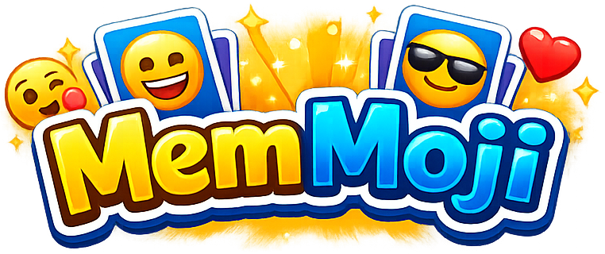
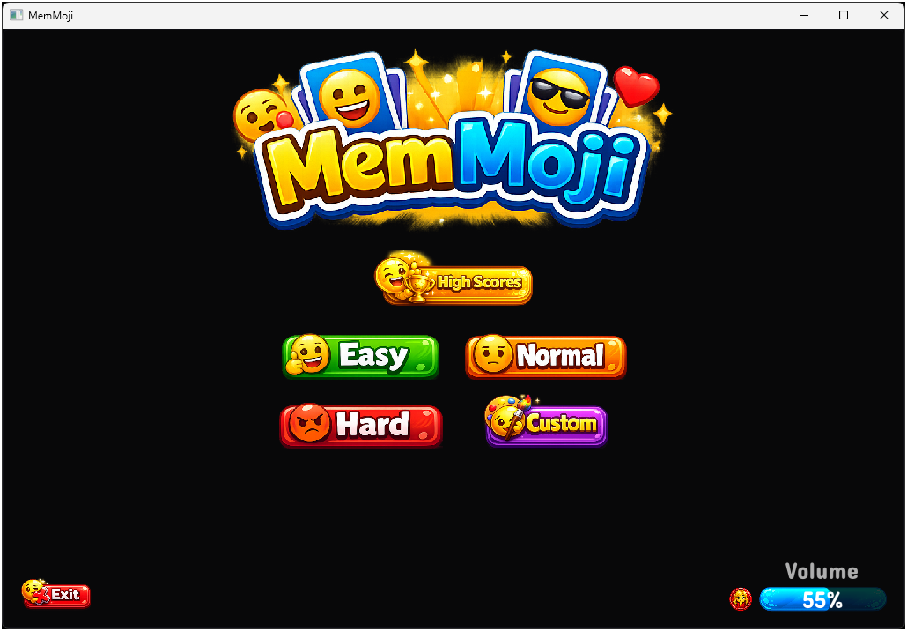
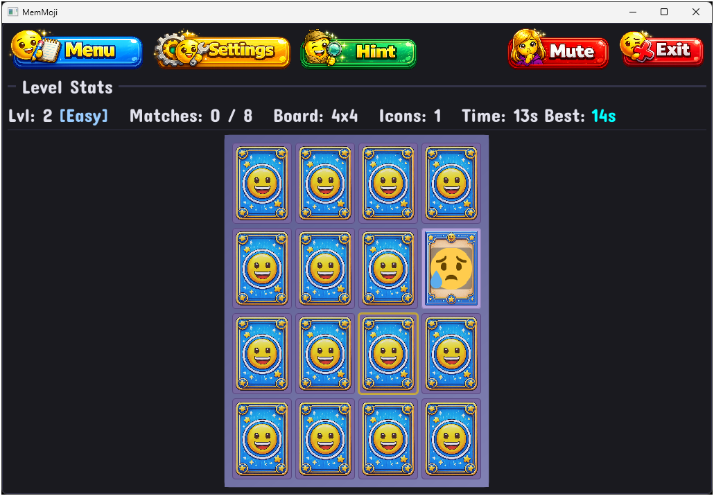
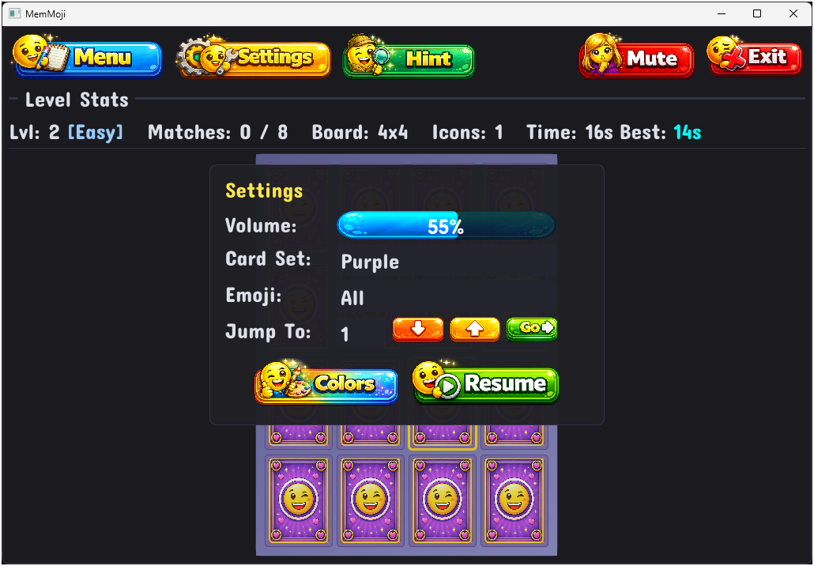
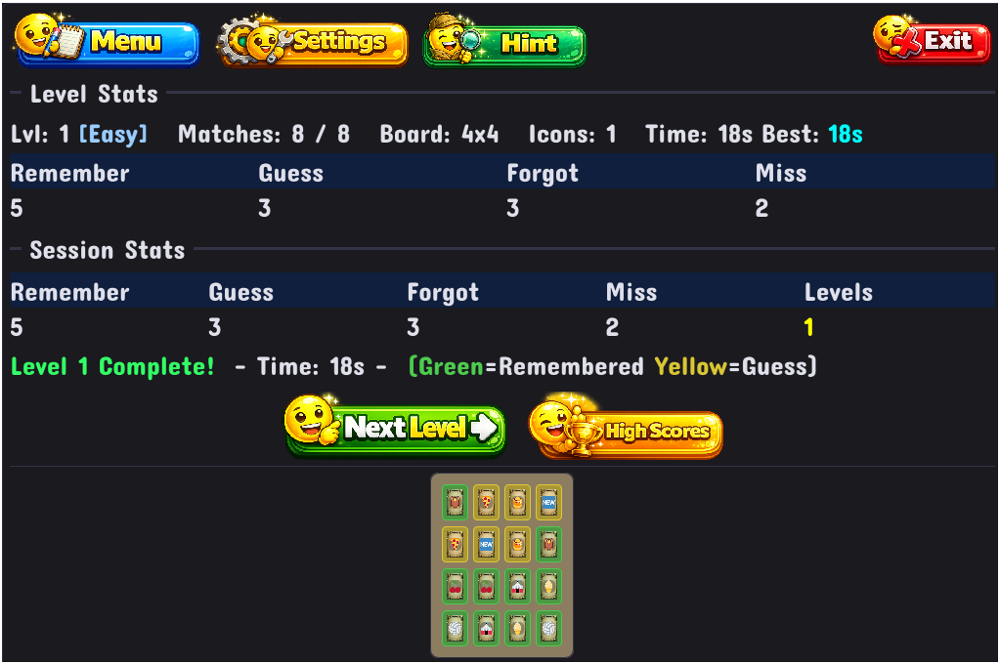
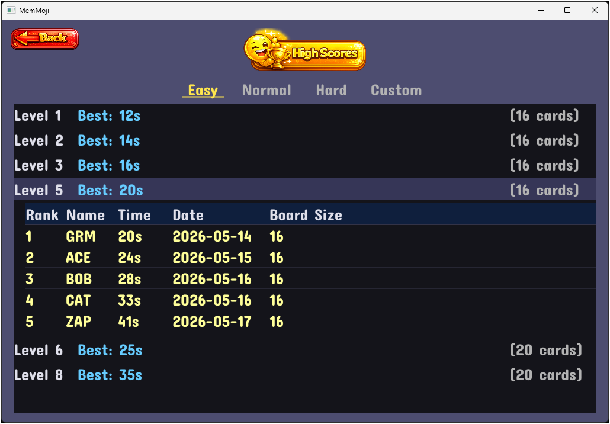
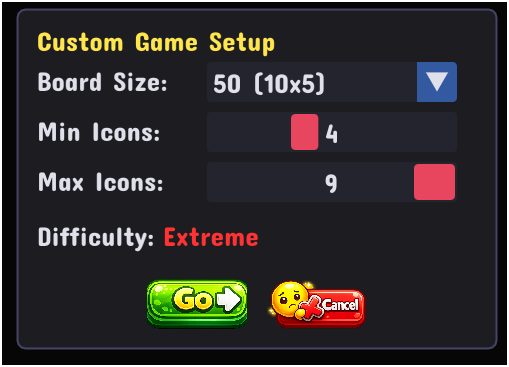

# MemMoji

A memory card matching game built with C++20, SDL2, OpenGL 3.3, and Dear ImGui.

---

## Directory

- [About the Game](#about-the-game)
- [How to Play](#how-to-play)
- [Download & Install](#download--install)
- [Documentation](#documentation)
- [License](#license)

---

## About the Game

Flip cards to find matching emoji pairs. Boards grow larger and patterns become more complex as you level up. Four difficulty modes, multiple emoji categories, swappable card skins, high score tracking, and a hint system keep things interesting.

**Features:**

- 4 difficulty modes — Easy, Normal, Hard, and Custom
- 500 Noto Color Emoji across 5 categories
- Cards can show 1–9 emoji per card at higher difficulties
- 7 board sizes from 16 to 50 cards
- 3 hints per level with pulsing gold border
- Per-level high score tracking with arcade-style initials
- Swappable card set skins
- Custom image-based UI with Concert One font
- JSON save data with atomic writes

[Back to Directory](#directory)

---

## How to Play

1. Choose a difficulty (Easy, Normal, Hard, or Custom) from the title screen.
2. Click cards to flip them. Find matching pairs to clear the board.
3. Match all pairs to complete the level and advance to larger boards.

**Controls:**

- **Click** a face-down card to flip it
- **Escape** opens Settings (pauses the game)
- **F11** toggles fullscreen

**Settings Panel:**

- **Volume** — blue slider bar, click or drag to adjust
- **Card Set / Emoji** — click to open dropdown and select
- **Jump To Level** — use up/down buttons and Go to skip ahead

**Level Complete:**

Green cards = Remembered, Gold cards = Guessed. Click **Next Level** to continue, or click **High Scores** to view the leaderboard for the current level.

**High Scores:**

The high scores table replaces the board area, showing Rank, Name, Time, and Date for the top 5 runs. Click Cancel to return to the board.

**Custom Mode:**

Choose your own board size and icon count for a tailored challenge. Click Go to start or Cancel to go back. Difficulty rating updates in real time.

[Back to Directory](#directory)

---

## Download & Install

Grab the latest release from the [Releases](../../releases) page.

### Windows

1. Download `MemMoji-Windows.zip` from the latest release.
2. Extract the zip to any folder.
3. Run `MemMoji.exe` — no installation required.

### Linux

1. Download `MemMoji-Linux.tar.gz` from the latest release.
2. Extract: `tar xzf MemMoji-Linux.tar.gz`
3. Run: `./MemMoji`

The `assets/` folder must be in the same directory as the executable. Both release packages include it.

[Back to Directory](#directory)

---

## Documentation

The full player manual is in the `Documentation/manual/` folder. Open `Documentation/manual/index.html` in your browser for an illustrated guide covering gameplay, difficulty levels, scoring, hints, high scores, and card sets.

[Back to Directory](#directory)

---

## License

Emoji graphics from [Noto Color Emoji](https://github.com/googlefonts/noto-emoji) by Google (Apache License 2.0).

[Back to Directory](#directory)
